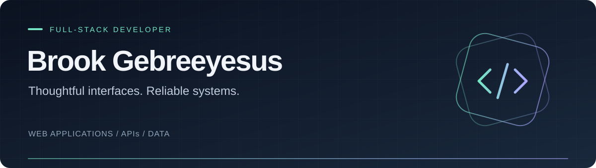

<a href="https://brookmulu.vercel.app/"><b>Portfolio ↗</b></a> &nbsp; · &nbsp; <a href="https://www.linkedin.com/in/brook-gebreeyesus"><b>LinkedIn ↗</b></a> &nbsp; · &nbsp; <a href="https://github.com/BrookMulu?tab=repositories"><b>Explore my code ↗</b></a>

I'm **Brook**, a Concordia College CS graduate building usable interfaces, dependable APIs, and practical enterprise tools. **React & Angular · .NET & Spring Boot.**

### Selected work

| Project | What it does | Explore |
| :--- | :--- | :--- |
| **01 / Pokédex** | Search Pokémon and save a personal collection. Next.js · Spring Boot · PostgreSQL · Firebase · Docker | [Frontend](https://github.com/BrookMulu/frontend-pokedex) · [Backend](https://github.com/BrookMulu/Backend-Pokedex) |
| **02 / Brook's Financial Observatory** | Financial statements, interactive charts, filters, and CSV exports. Next.js · React · REST APIs · Vercel | [Code](https://github.com/BrookMulu/brooks-financial-observatory) · [Demo](https://financial-data-filtering-app-swart.vercel.app/) |
| **03 / Computer Science Society** | A campus club website with an integrated contact form. Next.js · TypeScript · Chakra UI · EmailJS | [Code](https://github.com/BrookMulu/CSS_Website) · [Site](https://css-website-staging.vercel.app/) |

### My toolkit

<table>
<tr><td width="50%"><b>Frontend</b>   TypeScript · JavaScript · React · Next.js · Angular · HTML · CSS</td><td width="50%"><b>Backend</b>   C# · .NET · Java · Spring Boot · Node.js · REST APIs</td></tr>
<tr><td><b>Data</b>   &nbsp;  &nbsp;  PostgreSQL · Microsoft SQL Server · Oracle SQL</td><td><b>Delivery</b>   Git · Docker · Azure · Azure DevOps · CI/CD</td></tr>
</table>

<b>Experience & education</b>

- **Eide Bailly LLP — Application Developer Intern** · Jan–Aug 2024 Built hardware fulfillment tools with Angular, .NET, and MSSQL; modernized .NET applications and supported Azure delivery.
- **Doosan Digital Innovation America — Application Developer Co-op** · May–Dec 2023 Enhanced Angular/.NET applications and Oracle SQL integrations; supported Apriso MES manufacturing workflows.
- **Concordia College — B.A. in Computer Science** · Spring 2024

<b>Let's build something useful.</b> <a href="https://www.linkedin.com/in/brook-gebreeyesus">Let's connect ↗</a>

